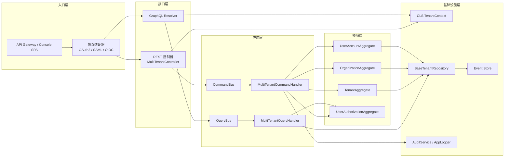

# IAM 系统开发方案（v2）

## 1. 背景与目标

- 构建面向多租户 SaaS 平台的统一身份认证与权限管理中心。
- 与最新宪章、《docs/guides/\*.md》多租户规范完全对齐，确保租户 → 组织 → 部门三级隔离可落地。
- 输出可复用的认证协议适配、权限评估、审计追踪与上下文管理能力，为业务模块提供统一接口。

## 2. 整体架构



> **关键说明**：所有横向链路必须显式传递 `tenantId`、`organizationId`、`departmentIds`，接口层需在进入应用层前完成上下文注入与校验。

### 2.1 项目目录结构

```
saas-platform/
├── docs/
│   ├── designs/
│   │   ├── iam-v2.md           # 当前文档
│   │   └── casl-*.md           # 权限方案
│   └── guides/                 # 多租户指南（权威规范）
├── libs/
│   ├── shared/                 # Shared Kernel（值对象、异常、工具）
│   ├── infra/
│   │   ├── multi-tenancy/      # CLS、BaseTenantRepository、订阅器
│   │   └── auth/               # 协议适配、认证工具
│   └── domains/
│       ├── tenant/
│       ├── organization/
│       ├── auth/
│       └── authorization/
├── core/
│   ├── domain/                 # 聚合、实体、领域服务
│   ├── application/            # CQRS 命令/查询、Saga
│   ├── interfaces/             # 控制器、装配器、守卫
│   └── infrastructure/         # 仓储实现、EventStore、日志等
├── apps/
│   └── iam-api/                # 对外接口入口（REST/GraphQL）
└── modules/
    ├── hr/                     # HR 业务模块
    └── crm/                    # CRM 业务模块
```

> 说明：`core` 目录聚合 IAM 核心领域；`libs` 提供可被其它业务复用的基础能力；`docs` 保存规范与设计文档。

## 3. 子域模块划分

| 子域           | 代码位置示例                | 职责简介                                          | 关键输出/示例                                                                      |
| -------------- | --------------------------- | ------------------------------------------------- | ---------------------------------------------------------------------------------- |
| Tenant         | `core/domain/tenant`        | 租户生命周期、订阅、状态管理、租户配置            | `TenantAggregate`、`TenantProvisioningSaga`（即将实现）                            |
| Organization   | `core/domain/organization`  | 组织、部门、成员关系，多层级结构维护              | 部门树构建、`GetOrdersQueryHandler` 组织级过滤示例                                 |
| Auth           | `core/domain/auth`          | 账户、凭证、会话管理，认证协议适配                | `UserAccountAggregate.register`/`deactivate`（§5.1）                               |
| Authorization  | `core/domain/authorization` | 角色、策略、权限事件（CASL 集成）                 | `RegisterUserCommandHandler` 权限校验（§5.2）、CASL 设计文档                       |
| Shared Kernel  | `core/domain/shared`        | 通用值对象、异常、时间模型、ID 工具               | `TenantId`/`OrganizationId`/`DepartmentId` 值对象、`UuidIdentity` 模板             |
| Application    | `core/application`          | CQRS 命令/查询处理器、Saga、事件桥接              | `MultiTenantCommandHandler` 示例（§5.2）、`docs/guides/application-layer-guide.md` |
| Interfaces     | `core/interfaces`           | REST/GraphQL/CLI 入口、装配器、守卫               | `MultiTenantLoggingInterceptor`、`TenantPermissionGuard`（参考接口层指南）         |
| Infrastructure | `infrastructure/`           | MikroORM 实体仓储、CLS、Event Store、日志、消息等 | `BaseTenantRepository`、`TenantAwareSubscriber`、`MultiTenantEventStore`           |

## 4. 核心设计原则

1. **多层数据隔离**
   - 所有命令/查询继承 `MultiTenantCommand` / `MultiTenantQuery`，聚合继承 `MultiTenantAggregateRoot`。
   - 仓储实现依赖 `BaseTenantRepository`，后续扩展 `findByTenantAndOrganization` 等方法，保证租户 → 组织 → 部门三级过滤。

2. **审计与事件追踪**
   - 聚合根必须维护 `createdAt`、`updatedAt`、`deletedAt`；软删除使用 `softDelete()` 并发布 `MultiTenantDomainEvent`。
   - 命令处理器统一调用 `saveMultiTenantAggregate` + `publishMultiTenantEvents`，审计服务记录关键信息。

3. **多协议认证**
   - `infrastructure/security` 提供 OAuth2/OIDC/SAML 适配器与策略配置。
   - 接口层通过守卫、拦截器统一解析认证结果，写入 `TenantContext`。

4. **CASL 权限评估**
   - `CaslAbilityFactory` 基于租户/组织/部门、角色、直接权限生成规则。
   - 查询处理器使用 `CaslMikroORMFilter` 生成过滤条件，保证读写一致。

5. **事件驱动权限一致性**
   - 权限领域采用事件溯源（ES）建模，命令触发的 `RoleAssignedEvent`、`PermissionGrantedEvent` 等会写入 Event Store。
   - 事件驱动架构（EDA）负责同步更新能力缓存、读模型投影与外部通知，确保 CQRS 查询侧与 CASL 能力保持一致。

## 5. 关键示例

### 5.1 聚合示例：UserAccountAggregate

```typescript
import { DateTime } from "luxon";

export class UserAccountAggregate extends MultiTenantAggregateRoot {
  private constructor(
    private readonly _id: UserId,
    tenantId: TenantId,
    private _email: Email,
    private _hashedPassword: string | null,
    private _phone: PhoneNumber | null,
    private _status: UserStatus = UserStatus.Active,
  ) {
    super(tenantId);
  }

  static register(command: RegisterUserCommand): UserAccountAggregate {
    const aggregate = new UserAccountAggregate(UserId.create(), TenantId.create(command.securityContext.tenantId), Email.create(command.email), PasswordHasher.hash(command.password), command.phone ? PhoneNumber.create(command.phone) : null);

    aggregate.touch();
    aggregate.addDomainEvent(new UserRegisteredEvent(aggregate._id, aggregate.tenantId, DateTime.now()));
    return aggregate;
  }

  deactivate(operator: UserId, reason: string): void {
    if (this._status === UserStatus.Inactive) {
      return;
    }
    this._status = UserStatus.Inactive;
    this.softDelete();
    this.addDomainEvent(new UserDeactivatedEvent(this._id, this.tenantId, operator, reason, DateTime.now()));
  }
}
```

### 5.2 命令处理器示例：RegisterUserCommandHandler

```typescript
@CommandHandler(RegisterUserCommand)
export class RegisterUserCommandHandler extends MultiTenantCommandHandler<RegisterUserCommand> {
  constructor(
    abilityService: CaslAbilityService,
    tenantRepository: TenantRepository,
    eventStore: EventStore,
    auditService: AuditService,
    eventBus: EventBus,
    private readonly userRepository: UserAccountRepository,
    private readonly commandValidator: CommandValidator,
  ) {
    super(abilityService, tenantRepository, eventStore, auditService, eventBus);
  }

  async execute(command: RegisterUserCommand): Promise<void> {
    await this.commandValidator.validate(command);
    await this.validateTenantStatus(command);
    await this.validateCommandPermission(command, "create", { __typename: "UserAccount" });

    const tenantId = TenantId.create(command.securityContext.tenantId);
    const email = Email.create(command.email);
    if (await this.userRepository.existsByEmail(tenantId, email)) {
      throw new BusinessRuleViolation("邮箱已被占用");
    }

    const aggregate = UserAccountAggregate.register(command);
    await this.userRepository.save(aggregate);

    const events = aggregate.getUncommittedEvents();
    await this.saveMultiTenantAggregate(aggregate);
    await this.publishMultiTenantEvents(events);

    await this.auditService.recordUserRegistered(command.securityContext, aggregate.id);
  }
}
```

### 5.3 事件驱动与能力缓存

- 权限聚合 `UserAuthorization` 采用事件溯源，命令触发的 `RoleAssignedEvent`、`PermissionGrantedEvent` 等写入 Event Store（见《CASL 多租户设计规范》§2）。
- 事件处理器 `RoleAssignedEventHandler` 会：
  1. 清除 `CaslAbilityService` 中用户的能力缓存；
  2. 更新读模型投影（如 `UserPermissionProjection`）；
  3. 发布二次通知事件 `PermissionChangedEvent`。
- Saga `PermissionChangeSaga` 负责跨系统同步、通知与审计，失败时触发补偿事件。
- 能力缓存的生成/刷新逻辑需复用 `CaslAbilityFactory`，确保命令与查询侧对齐。详细流程参见 `docs/designs/casl-muti-tenant-auth-cqrs-es-eda.md` 第 4 章。

## 6. 与其他模块的依赖与协同

- **`libs/shared/security`**：提供 `SecurityContext`、`TenantContext`，应用层/接口层在此基础上进行上下文注入。
- **`libs/infra/multi-tenancy`**：CLS、`BaseTenantRepository`、`TenantAwareSubscriber`；下阶段需扩展组织/部门过滤工具。
- **`docs/designs/casl-muti-tenant-auth-cqrs-es-eda.md`**：CASL 权限方案，本文中的聚合与命令需保持同步，包括缓存刷新、投影更新与 Saga 协作。新增的能力缓存服务、投影服务与 IAM 模块按事件驱动模式协同工作。
- **业务模块集成**：通过命令/查询总线或暴露的接口模块调用，复用 IAM 的认证与授权能力。

## 7. 下一步里程碑

1. **基础框架搭建**：落地 MultiTenant 命令/查询基类、CLS、审计、事件存储基础设施。
2. **认证协议适配**：实现 OIDC/OAuth2/SAML 登录流程与单点登录守卫。
3. **CASL 规则生成器**：结合租户/组织/部门上下文输出可复用的 `Ability`，确保读写对齐。
4. **审计与日志联通**：将关键事件写入 `AuditService` 与统一日志服务，满足合规要求。
5. **接口层联调**：REST/GraphQL 控制器接入 IAM 核心能力，并提供业务调用示例。
6. **测试与治理**：单元测试、集成测试、端到端验证；执行 Constitution Check 确认完全合规。
