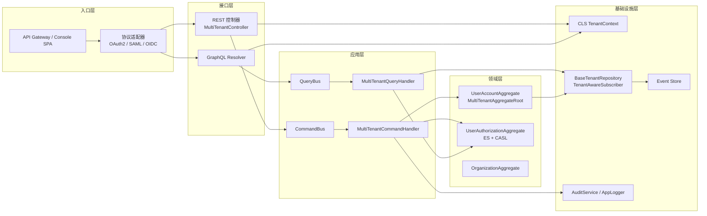

# IAM 系统开发方案

## 📋 项目概述

基于 CASL + CQRS + ES + EDA 的多租户组织权限 IAM 系统，提供完整的身份认证和访问控制解决方案。所有设计须与 `docs/guides/*.md` 的多租户规范及宪章要求保持一致，特别是日志、审计、命令/查询基类与多层数据隔离。

### 0.1 关键设计目标

- **多层隔离**：租户 → 组织 → 部门三级上下文，在命令、查询、仓储、日志审计中全链路透传。
- **多协议认证**：用户名密码、SAML、OAuth2、OIDC，可扩展 SSO/外部身份源。
- **统一授权模型**：基于 CASL 的角色/策略/资源建模，并与 CQRS/ES/EDA 事件流保持一致。
- **全链路审计**：所有关键行为写入审计总线，聚合根维护 `createdAt`/`updatedAt`/`deletedAt` 字段。
- **高可用与多活**：支持水平扩展、容灾、灰度发布。
- **生态扩展**：开放插件接口接入企业微信、钉钉、AD 等外部身份源。

## 1. 基于 Clean Architecture 的代码组织结构

### 1.1 项目整体结构

```
iam-system/
├── src/
│   ├── core/                          # 核心领域
│   │   ├── domain/                    # 领域层
│   │   │   ├── shared/                # 共享内核
│   │   │   ├── tenant/                # 租户子域
│   │   │   ├── organization/          # 组织子域
│   │   │   ├── auth/                  # 认证子域
│   │   │   └── authorization/         # 授权子域
│   │   ├── application/               # 应用层
│   │   │   ├── use-cases/             # 用例
│   │   │   ├── commands/              # 命令
│   │   │   ├── queries/               # 查询
│   │   │   └── events/                # 应用事件
│   │   └── interfaces/                # 接口层
│   │       ├── rest/                  # REST API
│   │       ├── graphql/               # GraphQL API
│   │       └── cli/                   # 命令行接口
│   ├── infrastructure/                # 基础设施层
│   │   ├── persistence/               # 持久化
│   │   ├── external-services/         # 外部服务
│   │   ├── message-brokers/           # 消息代理
│   │   └── security/                  # 安全基础设施
│   └── shared/                        # 共享资源
│       ├── kernel/                    # 内核
│       ├── utils/                     # 工具类
│       └── config/                    # 配置
├── tests/                             # 测试
└── docs/                              # 文档
```

### 1.2 详细模块结构

```
src/
├── core/
│   ├── domain/
│   │   ├── shared/
│   │   │   ├── value-objects/         # 值对象
│   │   │   ├── entities/              # 基础实体
│   │   │   ├── events/                # 基础事件
│   │   │   └── exceptions/            # 领域异常
│   │   ├── tenant/                    # 租户上下文
│   │   │   ├── aggregates/            # 聚合根
│   │   │   ├── entities/              # 实体
│   │   │   ├── value-objects/         # 值对象
│   │   │   ├── domain-services/       # 领域服务
│   │   │   ├── events/                # 领域事件
│   │   │   ├── repositories/          # 仓储接口
│   │   │   └── policies/              # 业务策略
│   │   ├── organization/              # 组织上下文
│   │   │   ├── aggregates/
│   │   │   ├── entities/
│   │   │   ├── value-objects/
│   │   │   ├── domain-services/
│   │   │   ├── events/
│   │   │   ├── repositories/
│   │   │   └── policies/
│   │   ├── auth/                      # 认证上下文
│   │   │   ├── aggregates/
│   │   │   ├── entities/
│   │   │   ├── value-objects/
│   │   │   ├── domain-services/
│   │   │   ├── events/
│   │   │   ├── repositories/
│   │   │   └── policies/
│   │   └── authorization/             # 授权上下文
│   │       ├── aggregates/
│   │       ├── entities/
│   │       ├── value-objects/
│   │       ├── domain-services/
│   │       ├── events/
│   │       ├── repositories/
│   │       └── policies/
│   ├── application/
│   │   ├── use-cases/
│   │   │   ├── tenant/
│   │   │   ├── organization/
│   │   │   ├── auth/
│   │   │   └── authorization/
│   │   ├── commands/
│   │   │   ├── handlers/              # 命令处理器
│   │   │   └── impl/                  # 命令实现
│   │   ├── queries/
│   │   │   ├── handlers/              # 查询处理器
│   │   │   └── impl/                  # 查询实现
│   │   ├── events/
│   │   │   ├── handlers/              # 事件处理器
│   │   │   └── sagas/                 # Saga
│   │   └── ports/                     # 端口
│   │       ├── repositories/          # 仓储接口
│   │       ├── services/              # 服务接口
│   │       └── event-publishers/      # 事件发布接口
│   └── interfaces/
│       ├── rest/
│       │   ├── controllers/           # 控制器
│       │   ├── dtos/                  # DTO
│       │   ├── filters/               # 异常过滤器
│       │   ├── guards/                # 守卫
│       │   ├── interceptors/          # 拦截器
│       │   ├── decorators/            # 装饰器
│       │   └── assemblers/            # 装配器
│       ├── graphql/
│       │   ├── resolvers/             # 解析器
│       │   ├── schemas/               # Schema
│       │   └── dtos/                  # DTO
│       └── cli/
│           ├── commands/              # 命令
│           └── questions/             # 交互问题
```

### 1.3 多租户 IAM 架构总览



## 2. 子领域划分

### 2.1 核心子领域

#### 2.1.1 租户管理 (Tenant Management)
**职责**: 多租户隔离、租户配置、订阅管理
```typescript
// 核心聚合根
- Tenant (租户)
- TenantSubscription (租户订阅)
- TenantConfiguration (租户配置)

// 核心领域服务
- TenantRegistrationService
- TenantProvisioningService
- TenantBillingService

// 关键用例
- 注册新租户
- 管理租户订阅
- 配置租户设置
```

#### 2.1.2 组织管理 (Organization Management)
**职责**: 组织创建、部门管理、成员管理
```typescript
// 核心聚合根
- Organization (组织)
- Department (部门)
- OrganizationMember (组织成员)

// 核心领域服务
- OrganizationStructureService
- DepartmentHierarchyService
- MemberInvitationService

// 关键用例
- 创建组织架构
- 管理部门层级
- 邀请组织成员
```

#### 2.1.3 身份认证 (Authentication)
**职责**: 用户认证、会话管理、凭证管理
```typescript
// 核心聚合根
- User (用户)
- UserCredential (用户凭证)
- UserSession (用户会话)

// 核心领域服务
- AuthenticationService
- PasswordService
- SessionManagementService

// 关键用例
- 用户登录/登出
- 密码重置
- 会话管理
```

#### 2.1.4 访问授权 (Authorization)
**职责**: 权限管理、角色管理、策略评估
```typescript
// 核心聚合根
- PermissionPolicy (权限策略)
- Role (角色)
- UserAuthorization (用户授权)

// 核心领域服务
- AuthorizationService
- PolicyEvaluationService
- CaslAbilityFactory

// 关键用例
- 分配角色权限
- 评估访问权限
- 管理权限策略
```

##### 用户账号聚合（示例）
```typescript
import { DateTime } from 'luxon';

export class UserAccountAggregate extends MultiTenantAggregateRoot {
  private constructor(
    private readonly _id: UserId,
    tenantId: TenantId,
    private _email: Email,
    private _hashedPassword: string | null,
    private _phone: PhoneNumber | null,
    private _status: UserStatus = UserStatus.Active
  ) {
    super(tenantId);
  }

  static register(command: RegisterUserCommand): UserAccountAggregate {
    const aggregate = new UserAccountAggregate(
      UserId.create(),
      TenantId.create(command.securityContext.tenantId),
      Email.create(command.email),
      PasswordHasher.hash(command.password),
      command.phone ? PhoneNumber.create(command.phone) : null
    );

    aggregate.touch();
    aggregate.addDomainEvent(new UserRegisteredEvent(aggregate._id, aggregate.tenantId, DateTime.now()));
    return aggregate;
  }

  deactivate(operator: UserId, reason: string): void {
    if (this._status === UserStatus.Inactive) {
      return;
    }

    this._status = UserStatus.Inactive;
    this.softDelete();
    this.addDomainEvent(new UserDeactivatedEvent(this._id, this.tenantId, operator, reason, DateTime.now()));
  }
}
```
> 说明：聚合根继承 `MultiTenantAggregateRoot`，自动维护 `createdAt`、`updatedAt`、`deletedAt` 字段，所有领域事件携带租户上下文与 `DateTime` 时间戳。

### 2.2 支撑子领域

#### 2.2.1 审计日志 (Audit Logging)
**职责**: 操作审计、安全日志、合规记录
```typescript
// 核心实体
- AuditLog (审计日志)
- SecurityEvent (安全事件)

// 核心服务
- AuditService
- ComplianceService
```

#### 2.2.2 通知服务 (Notification)
**职责**: 邮件通知、系统消息、实时通知
```typescript
// 核心实体
- Notification (通知)
- NotificationTemplate (通知模板)

// 核心服务
- EmailNotificationService
- RealTimeNotificationService
```

### 2.3 通用子领域

#### 2.3.1 共享内核 (Shared Kernel)
**职责**: 通用领域概念、基础类型、工具类
```typescript
// 通用值对象
- Email
- PhoneNumber
- DateTimeRange

// 基础实体
- Entity
- AggregateRoot
- DomainEvent

// 通用异常
- DomainException
- BusinessRuleViolationException
```

## 3. 主要技术栈和依赖

### 3.1 核心框架依赖

```json
{
  "dependencies": {
    // NestJS 核心
    "@nestjs/common": "^10.0.0",
    "@nestjs/core": "^10.0.0",
    "@nestjs/platform-express": "^10.0.0",
    "@nestjs/cqrs": "^10.0.0",
    "@nestjs/jwt": "^10.0.0",
    "@nestjs/passport": "^10.0.0",
    "@nestjs/swagger": "^7.0.0",
    
    // 数据库 ORM
    "@mikro-orm/core": "^5.9.0",
    "@mikro-orm/nestjs": "^5.0.0",
    "@mikro-orm/postgresql": "^5.9.0",
    "@mikro-orm/migrations": "^5.9.0",
    
    // 认证授权
    "@casl/ability": "^6.0.0",
    "@casl/mongoose": "^6.0.0",
    "passport": "^0.6.0",
    "passport-jwt": "^4.0.0",
    "passport-local": "^1.0.0",
    "bcryptjs": "^2.4.3",
    "jsonwebtoken": "^9.0.0",
    
    // 事件和消息
    "@nestjs/event-emitter": "^2.0.0",
    "amqplib": "^0.10.0",
    "redis": "^4.6.0",
    "ioredis": "^5.3.0",
    
    // 工具库
    "class-validator": "^0.14.0",
    "class-transformer": "^0.5.1",
    "reflect-metadata": "^0.1.13",
    "rxjs": "^7.8.0",
    "ulid": "^2.3.0",
    "lodash": "^4.17.21",
    
    // 配置管理
    "@nestjs/config": "^3.0.0",
    "convict": "^6.2.0"
  },
  "devDependencies": {
    // 开发工具
    "@nestjs/testing": "^10.0.0",
    "@types/jest": "^29.0.0",
    "@types/node": "^20.0.0",
    "@types/passport-jwt": "^3.0.9",
    "@types/bcryptjs": "^2.4.2",
    "@types/jsonwebtoken": "^9.0.0",
    "@types/lodash": "^4.14.0",
    
    // 测试框架
    "jest": "^29.0.0",
    "ts-jest": "^29.0.0",
    "supertest": "^6.3.0",
    
    // 代码质量
    "eslint": "^8.0.0",
    "prettier": "^3.0.0",
    "husky": "^8.0.0",
    "lint-staged": "^13.0.0",
    
    // 构建工具
    "typescript": "^5.0.0",
    "ts-node": "^10.9.0",
    "tsconfig-paths": "^4.0.0"
  }
}
```

### 3.2 CASL 集成配置

```typescript
// src/infrastructure/security/casl/casl.module.ts
@Module({
  imports: [
    CqrsModule,
    // 其他依赖模块
  ],
  providers: [
    // CASL 能力工厂
    {
      provide: 'ICaslAbilityFactory',
      useClass: OrganizationAwareCaslAbilityFactory
    },
    
    // CASL 能力服务
    {
      provide: 'ICaslAbilityService',
      useClass: CachedCaslAbilityService
    },
    
    // CASL 查询过滤器
    {
      provide: 'ICaslQueryFilter',
      useClass: MikroORMCaslFilter
    },
    
    // CASL 守卫
    CaslGuard,
    
    // CASL 策略装饰器
    CaslPoliciesProvider
  ],
  exports: [
    'ICaslAbilityFactory',
    'ICaslAbilityService',
    'ICaslQueryFilter',
    CaslGuard
  ]
})
export class CaslModule {}
```

> 多层隔离提示：CASL 能力工厂必须基于 `tenantId`、`organizationId`、`departmentIds` 组合生成规则，所有 `Ability` 计算应调用与多租户基础设施一致的查询过滤器，防止跨层级越权。

### 3.3 CQRS 模块配置

```typescript
// src/core/application/cqrs/cqrs.module.ts
@Module({
  imports: [
    // 事件存储
    EventStoreModule,
    
    // 消息代理
    MessageBrokerModule,
    
    // CASL 集成
    CaslModule
  ],
  providers: [
    // 命令总线
    CommandBus,
    
    // 查询总线
    QueryBus,
    
    // 事件总线
    EventBus,
    
    // Saga 管理器
    {
      provide: 'ISagaManager',
      useClass: EventSourcingSagaManager
    },
    
    // 命令处理器
    ...commandHandlers,
    
    // 查询处理器
    ...queryHandlers,
    
    // 事件处理器
    ...eventHandlers,
    
    // Saga
    ...sagas
  ],
  exports: [
    CommandBus,
    QueryBus,
    EventBus,
    'ISagaManager'
  ]
})
export class CqrsModule {}
```

### 3.3.1 注册用户命令处理器（示例）
```typescript
@CommandHandler(RegisterUserCommand)
export class RegisterUserCommandHandler extends MultiTenantCommandHandler<RegisterUserCommand> {
  constructor(
    abilityService: CaslAbilityService,
    tenantRepository: TenantRepository,
    eventStore: EventStore,
    auditService: AuditService,
    eventBus: EventBus,
    private readonly userRepository: UserAccountRepository,
    private readonly commandValidator: CommandValidator
  ) {
    super(abilityService, tenantRepository, eventStore, auditService, eventBus);
  }

  async execute(command: RegisterUserCommand): Promise<void> {
    await this.commandValidator.validate(command);
    await this.validateTenantStatus(command);
    await this.validateCommandPermission(command, 'create', { __typename: 'UserAccount' });

    const tenantId = TenantId.create(command.securityContext.tenantId);
    const email = Email.create(command.email);

    if (await this.userRepository.existsByEmail(tenantId, email)) {
      throw new BusinessRuleViolation('邮箱已被占用');
    }

    const aggregate = UserAccountAggregate.register(command);
    await this.userRepository.save(aggregate);

    const events = aggregate.getUncommittedEvents();
    await this.saveMultiTenantAggregate(aggregate);
    await this.publishMultiTenantEvents(events);

    await this.auditService.recordUserRegistered(command.securityContext, aggregate.id);
  }
}
```
> 说明：命令处理器复用多租户基类能力，统一完成租户状态校验、权限校验、事件存储与审计记录。

### 3.4 数据库配置

```typescript
// src/infrastructure/persistence/database.config.ts
export default defineConfig({
  // MikroORM 配置
  entities: [
    // 租户实体
    TenantEntity,
    TenantSubscriptionEntity,
    
    // 组织实体
    OrganizationEntity,
    DepartmentEntity,
    OrganizationMemberEntity,
    
    // 认证实体
    UserEntity,
    UserCredentialEntity,
    UserSessionEntity,
    
    // 授权实体
    RoleEntity,
    PermissionEntity,
    UserAuthorizationEntity,
    
    // 事件存储实体
    EventEntity,
    SnapshotEntity
  ],
  
  // 多租户配置
  tenantConnection: {
    strategy: 'schema', // 每个租户独立 schema
    tenantIdentifier: 'tenant_id'
  },
  
  // 性能优化
  cache: {
    enabled: true,
    options: { cacheDir: process.cwd() + '/temp' }
  },
  
  // 迁移配置
  migrations: {
    path: './src/infrastructure/persistence/migrations',
    transactional: true,
    allOrNothing: true
  }
} as Options);
```

### 3.5 安全配置

```typescript
// src/infrastructure/security/security.config.ts
@Injectable()
export class SecurityConfig {
  // JWT 配置
  get jwtConfig(): JwtConfig {
    return {
      secret: this.getRequired('JWT_SECRET'),
      expiresIn: this.get('JWT_EXPIRES_IN', '1h'),
      refreshExpiresIn: this.get('JWT_REFRESH_EXPIRES_IN', '7d'),
      issuer: this.get('JWT_ISSUER', 'iam-system')
    };
  }
  
  // 密码策略
  get passwordPolicy(): PasswordPolicy {
    return {
      minLength: 8,
      requireUppercase: true,
      requireLowercase: true,
      requireNumbers: true,
      requireSymbols: false,
      maxAgeDays: 90
    };
  }
  
  // CASL 配置
  get caslConfig(): CaslConfig {
    return {
      cacheTtl: parseInt(this.get('CASL_CACHE_TTL', '300')), // 5分钟
      maxRulesPerUser: parseInt(this.get('CASL_MAX_RULES', '1000')),
      enableFieldLevel: this.get('CASL_FIELD_LEVEL', 'true') === 'true'
    };
  }
}
```

### 3.6 相关模块依赖
- `libs/shared/security`：定义 `SecurityContext`、`TenantContext`，与 `MultiTenantCommand`/`MultiTenantQuery` 共享同一上下文模型。
- `libs/infra/multi-tenancy`：提供 CLS、`BaseTenantRepository`、`TenantAwareSubscriber`，下一阶段重构将扩展组织/部门级过滤策略。
- `libs/infra/auth`：统一认证协议适配（OAuth2/OIDC/SAML 等）。
- `libs/applications/auth`：IAM CQRS 命令/查询实现，必须继承多租户命令/查询处理器基类。
- `libs/domains/auth` 与 `libs/domains/permission`：领域聚合均继承 `MultiTenantAggregateRoot`，事件类型必须使用 `MultiTenantDomainEvent`。
- `docs/designs/casl-muti-tenant-auth-cqrs-es-eda.md`：权限设计详细说明，需要与本文保持同步。
- `docs/guides/*.md`：多租户规范的权威来源，IAM 实现的所有模块需逐条对照执行。

## 4. 开发阶段规划

### 4.1 第一阶段：基础架构 (2-3周)
- [ ] 搭建 Clean Architecture 骨架
- [ ] 配置 NestJS + MikroORM + CQRS
- [ ] 实现基础领域模型
- [ ] 设置开发环境和工具链

### 4.2 第二阶段：核心功能 (4-5周)
- [ ] 实现租户管理
- [ ] 实现组织部门管理
- [ ] 实现基础认证
- [ ] 集成 CASL 授权

### 4.3 第三阶段：高级特性 (3-4周)
- [ ] 实现事件溯源
- [ ] 实现消息驱动
- [ ] 实现审计日志
- [ ] 性能优化和缓存

### 4.4 第四阶段：集成测试 (2周)
- [ ] 编写单元测试和集成测试
- [ ] 进行安全测试
- [ ] 性能测试和压力测试
- [ ] 文档编写

## 5. 关键设计决策

### 5.1 架构决策
- **Clean Architecture**: 确保业务逻辑与技术实现分离
- **CQRS**: 读写分离，优化查询性能
- **事件溯源**: 保证数据一致性和审计能力
- **多租户**: Schema 级别隔离，确保数据安全

### 5.2 技术决策
- **CASL**: 声明式权限管理，支持复杂业务规则
- **MikroORM**: 优秀的 TypeScript 支持和性能
- **事件驱动**: 松耦合，高可扩展性
- **缓存策略**: 多级缓存，提升性能

### 5.3 安全决策
- **JWT + Refresh Token**: 无状态认证
- **RBAC + ABAC**: 混合权限模型
- **字段级权限**: 精细化访问控制
- **完整审计**: 满足合规要求

这套方案提供了一个完整、可扩展的 IAM 系统基础，能够满足企业级多租户认证授权的复杂需求。